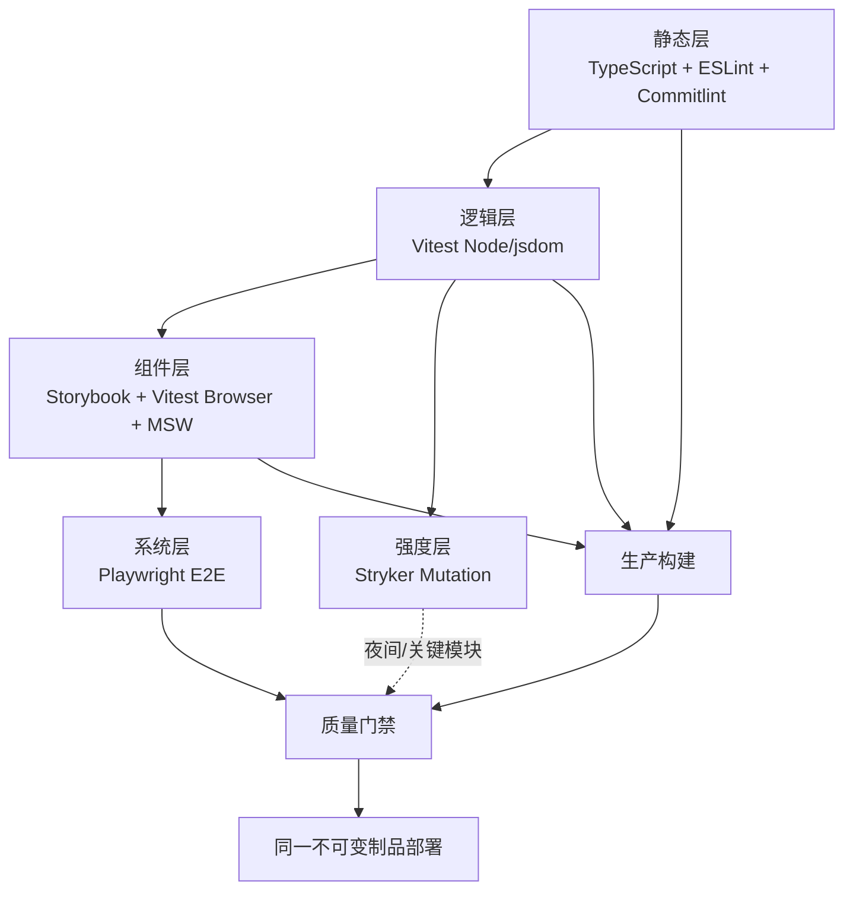

# 通用前端测试体系

校准日期：2026-07-29。

## 目标

这套体系优化的是“单位反馈时间内的可信度”，不是测试数量。它要同时满足：

- 开发者在数秒内得到局部反馈；
- PR 在可接受时间内覆盖静态质量、行为、浏览器与生产构建；
- 夜间流水线承担高成本的跨浏览器和变异测试；
- 同一份 Mock 语义能用于本地开发、组件状态和 jsdom 测试；
- 构建制品只生成一次，部署的是已经通过测试的同一个制品；
- 失败时保留 coverage、Storybook、Trace、截图、录像和 mutation report。

## 分层架构



| 层                 | 环境                | 主要职责                                   | 不应承担             |
| ------------------ | ------------------- | ------------------------------------------ | -------------------- |
| 静态层             | Node                | 类型、规则、提交语义、格式                 | 运行时行为           |
| 纯逻辑单测         | Node                | 算法、解析、状态机、校验器                 | DOM 细节             |
| 组件集成           | jsdom               | 用户可见行为、表单、Hook、上下文、请求分支 | CSS 布局、浏览器兼容 |
| Storybook 组件测试 | 真浏览器            | UI 状态目录、交互、可访问性、浏览器 API    | 全站导航与真实后端   |
| Playwright E2E     | 生产构建 + 真浏览器 | 路由、鉴权、关键业务链、浏览器兼容         | 穷举组件 props       |
| Stryker            | Vitest              | 检测“有覆盖但无有效断言”                   | 替代功能测试         |

## 工具边界

### Vitest 4 + jsdom

默认 `environment` 是 Node；只有需要 DOM 的项目使用 jsdom。模板把 jsdom 项目命名为
`unit`，并将 URL 固定为 `http://localhost:3000`，让 `fetch`、URL 和路由行为可预测。
Vitest 官方同时支持 jsdom 和浏览器模式，并支持项目拆分、覆盖率与分片：
[Vitest Features](https://v4.vitest.dev/guide/features)。

规则：

- 测试默认隔离，`restoreMocks`、`clearMocks`、`unstubGlobals` 全开。
- 时间、随机数、时区必须显式固定。
- 不 Mock React、路由器或请求库的内部实现；优先 Mock 网络边界。
- 每个异步断言必须等待用户可见结果，禁止裸 `setTimeout`。

### Testing Library

测试应尽量像用户使用软件。查询优先级为 `getByRole`/`findByRole`、
`getByLabelText`，最后才是 `data-testid`。这是 Testing Library 的
[查询优先级](https://testing-library.com/docs/queries/about/) 和
[指导原则](https://testing-library.com/docs/guiding-principles/)。

交互统一从 `userEvent.setup()` 创建会话，并 `await` 每个操作；只有无法由
`user-event` 表达的低级事件才使用 `fireEvent`。官方说明见
[user-event Introduction](https://testing-library.com/docs/user-event/intro/)。

### MSW 2

MSW 在 Node 中拦截 Vitest 发出的网络请求，在浏览器中为 Storybook 提供相同的
HTTP/GraphQL 行为。Vitest 官方也推荐 MSW 处理请求 Mock：
[Mocking Requests](https://v4.vitest.dev/guide/mocking/requests)。

目录约定：

```text
src/mocks/handlers.ts   # 默认成功行为
src/mocks/server.ts     # Vitest setupServer
*.stories.tsx           # 每个 story 覆盖 error/empty/loading/slow 等状态
```

强制规则：

- Vitest 使用 `onUnhandledRequest: 'error'`，未知请求立即失败。
- 每个测试后 `server.resetHandlers()`，避免状态泄漏。
- Handler 返回符合真实接口契约的数据；建议由 OpenAPI/GraphQL 类型生成。
- Storybook 10 使用 `msw-storybook-addon` 的 CSF Next `beforeEach`，而不是已弃用的
  CSF3 loader。官方示例见
  [MSW Storybook Addon](https://github.com/mswjs/msw-storybook-addon#provide-handlers)。
- Playwright E2E 默认用 `page.route()`；Playwright 官方指出 Service Worker 会让原生
  route 看不到请求。不要在同一个 E2E 测试中混用两套拦截器：
  [Playwright Network](https://playwright.dev/docs/network)。

如团队必须在 E2E 复用 MSW handler，可评估官方 `@msw/playwright`，但当前仍是
0.x；应封装在自有 fixture 后再引入，不让业务测试直接依赖其 API。

### Storybook 10 + Vitest Browser Mode

Story 是 UI 状态的可执行清单。Vitest Addon 会把 story 转成 Vitest 测试，在
Playwright 提供的真浏览器中运行；无需另外维护旧的 Jest test-runner。官方对比见
[Storybook Vitest Addon](https://storybook.js.org/docs/writing-tests/integrations/vitest-addon/index)。

每个有业务意义的组件至少覆盖：

- default/success；
- loading；
- empty；
- recoverable error；
- permission/disabled（适用时）；
- 关键交互的 `play`；
- `a11y.test: 'error'` 的稳定状态。

Story 不等于截图。它同时是开发夹具、评审材料、交互测试和视觉回归输入。视觉基线可以
接入 Chromatic，也可以对稳定 Story 使用 Playwright screenshot；二者选一作为权威，
避免双份基线。

### Playwright

PR 只跑 Chromium 关键路径；Firefox、WebKit 和更大数据集放到夜间矩阵。配置遵循：

- CI 才开启 2 次 retry；
- `trace: 'on-first-retry'`；
- 失败保留截图、录像、HTML report；
- 每个测试自行准备数据，禁止依赖执行顺序；
- 优先 `getByRole`，禁止 CSS 结构选择器；
- `forbidOnly` 在 CI 开启。

Trace 是 CI 失败的首要诊断材料，官方建议在首次重试记录：
[Playwright Trace Viewer](https://playwright.dev/docs/trace-viewer)。

E2E 分为两类并明确命名：

1. `mocked`：对第三方或难构造场景使用 `page.route`，高确定性；
2. `staging`：连接真实测试后端，只覆盖发布前必须成立的契约和主路径。

Mocked E2E 不是后端联调证明。真实接口兼容性必须由契约测试或 staging smoke 补足。

### Stryker

行覆盖率只能说明代码被执行，Stryker 检查断言能否识别被修改的错误实现。模板使用独立
`vitest.mutation.config.ts`，原因是变异运行不需要 Storybook 多项目配置；真实案例
Recharts 也采用独立 Vitest mutation config。

运行策略：

- PR：仅对核心领域或变更文件按需运行；
- `main`/夜间：全量关键模块；
- `coverageAnalysis: 'perTest'`；
- 开启 incremental 以缩短本地重复运行；
- 初始 break 70，稳定后提高到 80；支付、权限、价格等核心模块目标 90。

Stryker 的增量机制会保存前次结果并只重测变化：
[Stryker Incremental](https://stryker-mutator.io/docs/stryker-js/incremental/)。

## 测试归属判定

新需求先回答“最便宜的哪一层能可靠捕获这个回归”：

| 回归类型                              | 首选测试                      |
| ------------------------------------- | ----------------------------- |
| 纯函数分支、状态机、格式转换          | Vitest Node                   |
| 表单校验、请求成功/失败、Context 协作 | Testing Library + jsdom + MSW |
| 组件所有可见状态、浏览器 API、a11y    | Storybook Browser             |
| 登录、路由、跨页结算、文件下载        | Playwright                    |
| 高覆盖但仍频繁漏 Bug 的核心算法       | Stryker                       |

同一规则只在一个最合适的层穷举；上层保留一条代表性主路径即可。

## 质量门禁

模板给出可启动的默认值，不要求历史仓库立即达到 100%。

| 指标              | 新项目默认            | 存量仓库迁入策略         |
| ----------------- | --------------------- | ------------------------ |
| Statements        | 85%                   | 记录基线，禁止下降       |
| Lines             | 85%                   | 变更行建议 ≥ 90%         |
| Functions         | 85%                   | 核心模块单独设高门槛     |
| Branches          | 80%                   | 优先补错误与边界分支     |
| Mutation score    | break 70 / high 80    | 先报告，4–8 周后阻塞     |
| Story render/play | 100% 通过             | 新增/改动 Story 必须通过 |
| A11y              | 稳定 Story 零严重违规 | 分批清债，新增零容忍     |
| PR E2E            | Chromium 关键路径     | 失败阻塞                 |
| Nightly E2E       | 三浏览器              | 失败告警并建缺陷         |

覆盖率例外必须写进配置并说明原因，不能通过大范围 exclude 达标。对自动生成代码、
类型声明、入口装配可排除；业务分支不可排除。

## CI/CD

### PR 流水线

`ci.yml` 将工作拆成并行 Job：

1. Static：TypeScript、ESLint、Prettier、PR commit range 的 Commitlint；
2. Unit：Vitest + V8 coverage；
3. Storybook：Chromium component/play/a11y + 静态构建；
4. Build：生成一次 `dist` 并上传不可变 artifact；
5. E2E：下载该 `dist`，只跑 Chromium；
6. Quality gate：汇总所有结果，作为分支保护唯一必选检查。

建议 GitHub branch protection：

- Require pull request；
- Require `Quality gate`；
- Require branch up to date；
- Require conversation resolution；
- 禁止管理员绕过（高风险仓库）；
- `main` 禁止 force push。

### 夜间流水线

- `e2e-nightly.yml`：Chromium/Firefox/WebKit 矩阵；
- `mutation.yml`：Stryker 全量关键模块；
- 失败不自动忽略，应通知责任团队并生成可追踪缺陷；
- flaky 测试最多 quarantine 7 天，必须带 owner、原因和到期日。

### CD

`deploy-pages.yml` 通过 `workflow_run` 只接受成功的 `CI`，再按 run id 下载
`app-dist`。手动发布时必须输入一个成功 CI 的 run id。部署阶段不会重新构建，这避免
“测试 A、发布 B”。

企业环境可以把 Pages 替换为：

```text
CI artifact → staging deploy → Playwright smoke → protected production environment
→ production deploy → smoke → rollback to previous artifact
```

GitHub Environment 应配置审批人、分支限制和最小权限。GitHub Pages 官方的 artifact →
deploy 模式见
[Custom workflows with GitHub Pages](https://docs.github.com/en/pages/getting-started-with-github-pages/using-custom-workflows-with-github-pages)。

## Git hooks 与提交治理

Hook 只做快速反馈：

- `pre-commit`：lint-staged，只处理暂存文件；
- `commit-msg`：Commitlint；
- 不在 Hook 中跑全量 E2E、Storybook 或 Stryker。

CI 仍需重复检查，因为 Hook 可以被跳过。Commitlint 官方要求使用 `commit-msg`
而不是 `pre-commit`：
[Commitlint Local Setup](https://commitlint.js.org/guides/local-setup.html)。

提交建议采用 Conventional Commits：

```text
feat(profile): add retry action
fix(auth): preserve redirect after token refresh
test(checkout): cover declined card response
```

## Flaky、隔离和可观测性

- 禁止通过增加固定 sleep 修复 flaky；
- 重试只用于收集 Trace，不把“重试后通过”视为健康；
- 每个失败 artifact 保留至少 14 天；
- 测试日志不得输出 token、cookie、个人数据；
- 测试数据使用唯一前缀并在 teardown 清理；
- 浏览器、Node、时区、locale 在 CI 固定；
- 统计 P50/P95 时长、flaky rate、mutation score、逃逸缺陷，而不只看测试数。

建议 SLO：

| 指标            | 目标          |
| --------------- | ------------- |
| 本地相关单测    | P95 < 10 秒   |
| PR Quality gate | P95 < 12 分钟 |
| flaky rate      | < 0.5%        |
| 主干红灯恢复    | < 2 小时      |

## 落地路线

### 第 1 阶段：1–2 周

- 固定 Node/pnpm 与 lockfile；
- 接入 TypeScript、ESLint、Husky、Commitlint；
- 建立 Vitest/jsdom/Testing Library/MSW 基础；
- CI 先报告现有覆盖率，不阻塞历史债务。

### 第 2 阶段：2–4 周

- 为改动组件补 success/loading/empty/error Story；
- 启用 Storybook Vitest Browser 与 a11y；
- 新代码启用覆盖率门禁，仓库总覆盖率禁止回退。

### 第 3 阶段：2–4 周

- Playwright 覆盖 5–15 条最高价值关键路径；
- PR Chromium，夜间三浏览器；
- 统一 Trace、截图、录像 artifact。

### 第 4 阶段：持续

- Stryker 先覆盖领域核心，再扩展；
- 接入变更行覆盖率与趋势看板；
- CD 改为构建一次、逐环境晋级同一制品；
- 每季度删除重复、低价值和长期 flaky 测试。
